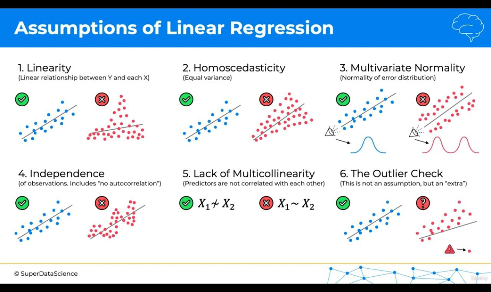

#### Multiple Linear Regression

##### Assumptions of Linear Regression (checks used to identify when to use regression model)
1. Linearity - Linear releationship between Y and each X
2. Homoscendasticity - Equal variance (no cone like structure)
3. Multivariate Normality - Normality of error distrubition
4. Independence - Of observatinos. Includes "no autocorrelation"
5. Lack of Multicollinearity - Predictors are not correlated with each other
6. The Outlier Check - This is not an assumption, but an "extra"

##### Dummy Variable
- Dummy variables in multiple linear regression are used to represent categorical variables by converting them into numeric form (0s and 1s), allowing the model to include them as predictors. They indicate the presence or absence of a category, with one category taken as a baseline, and show how each category affects the dependent variable compared to that baseline.
- Always include only one variable in the multiple linear regression equation

##### Building A Model
1. All-in - Use all the variables (features)
2. Backward Elimination (stepwise regression)
    - Remove the variables one by one, which has the highest P-value (predictor), until P > SL (significance level)
3. Forward Selection (stepwise regression)
    - Add the varibles one by one, which has the lower P-value (predictor), until P < SL (significance level)
4. Bidirectional Elimination (stepwise regression)
    - Combination of 2 and 3
5. Score Comparision

**Note**: We don't need feature scaling in multiple linear regression

